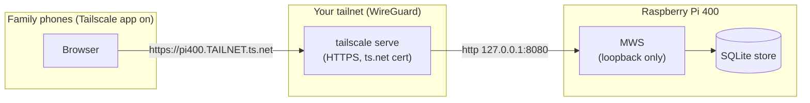

# Deploying the Moving House task app on a Raspberry Pi 400 over Tailscale

This runbook stands up the MWS-based family task app on the Pi 400 and makes it
reachable **only** from family members' phones over your private Tailscale network
(tailnet) — no public exposure.

> Tailscale command specifics below are from general knowledge (this environment had
> no web access to fetch live docs). They are stable, but verify exact flags against
> the current docs at `tailscale.com/kb` before running, especially `tailscale serve`.

> **Server ops are canonical in the fork.** This runbook covers the *app-specific* parts
> (seeding the moving-house list + household members). For the general MWS server operations
> — listener config, systemd, Tailscale Serve, `secure=true`, and backups — the maintained
> reference is the fork's `docs/operations.md` (with `docs/security.md` for the security
> posture); the steps below mirror it.

## Architecture



Key idea: **MWS listens on loopback (127.0.0.1) only** and never touches the LAN.
`tailscale serve` is the only thing in front of it, and only tailnet devices can reach
that. Pi-hole (ports 53/80) and MWS (8080, loopback) do not clash.

---

## Part A — Install and run MWS on the Pi

```bash
# 1. Prereqs: Node 20+ and git. Check:
node -v        # expect v20.x

# 2. Get the fork (branch with the HTMX admin + fixes)
git clone -b Alternative-to-react https://github.com/dxcSithLord/MultiWikiServer.git mws
cd mws

# 3. Install with npm 10 (npm 9's Arborist crashes on this workspace)
npx --yes npm@10 install

# 4. Build
npm run build

# 5. Bind to loopback only, behind the TLS-terminating Tailscale Serve proxy.
#    secure=true marks the session cookie Secure even though MWS speaks plain HTTP to
#    the proxy (see the fork's docs/operations.md and docs/security.md).
mkdir -p dev
cat > dev/mws.dev.json <<'JSON'
[ { "host": "127.0.0.1", "port": 8080, "secure": true } ]
JSON

# 6. Initialise the store (creates admin / 1234, applies migrations, imports docs)
npm start init-store
```

**Immediately rotate the admin password** — do not leave `1234`. The fork ships a CLI for
this: `npm start reset-password admin <new-password>` (or change it from the HTMX admin
profile/password page after logging in).

### Seed the Moving House task list and the household members

From the machine that has the `moving-house-wiki/` folder and `seed-household.mjs`
(copy them to the Pi, e.g. into the parent of `mws/`):

```bash
# Load the checklist into a moving-house bag + recipe (run from the fork dir)
ENABLE_DEV_SERVER=mws ENABLE_EXTERNAL_PLUGINS=1 node mws.dev.mjs load-wiki-folder \
  ../moving-house-wiki \
  --bag-name moving-house --bag-description "Moving House shared family task list" \
  --recipe-name moving-house --recipe-description "Moving House shared family task list"

# With MWS running, create the household role + members + grant ACL
# (edit MWS_MEMBERS to the real usernames first)
MWS_DIR="$PWD" MWS_MEMBERS="alice,bob,carol" node ../seed-household.mjs
```

`seed-household.mjs` prints one-time temporary passwords — give each member theirs
privately; they change it on first login.

### Run MWS as a service (survives reboot)

Create `/etc/systemd/system/mws.service` (adjust `User` and paths):

```ini
[Unit]
Description=MWS family task app
After=network-online.target

[Service]
Type=simple
User=sithlord
WorkingDirectory=/home/sithlord/mws
ExecStart=/usr/bin/npm start
Restart=on-failure
RestartSec=5

[Install]
WantedBy=multi-user.target
```

```bash
sudo systemctl daemon-reload
sudo systemctl enable --now mws
systemctl status mws          # confirm it's listening on 127.0.0.1:8080
curl -sf http://127.0.0.1:8080/login >/dev/null && echo "MWS up"
```

---

## Part B — Put the Pi on Tailscale

```bash
# Install Tailscale (Debian/Raspberry Pi OS)
curl -fsSL https://tailscale.com/install.sh | sh

# Bring it up (opens a login URL; authenticate with YOUR Tailscale account)
sudo tailscale up

# Note the device's MagicDNS name, e.g. pi400.<your-tailnet>.ts.net
tailscale status
```

In the **Tailscale admin console** (login.tailscale.com), enable:
- **MagicDNS** (so `pi400.<tailnet>.ts.net` resolves on members' devices), and
- **HTTPS certificates** (required for `tailscale serve` to obtain a Let's Encrypt
  cert for the `.ts.net` name).

---

## Part C — Expose MWS inside the tailnet with `tailscale serve`

```bash
# Terminate HTTPS at Tailscale and proxy to the loopback MWS.
# Verify exact syntax against current docs; recent Tailscale uses:
sudo tailscale serve --bg https / http://127.0.0.1:8080

# Confirm
tailscale serve status

# Make sure Funnel (public internet exposure) is OFF — we do NOT want this:
tailscale funnel status        # should show nothing enabled
```

Now `https://pi400.<your-tailnet>.ts.net/` reaches MWS — but only from devices on
your tailnet. The cert is a real Let's Encrypt cert for the `.ts.net` name, so phone
browsers trust it automatically (no manual cert install).

---

## Part D — Give each family member access

Two layers — network access (Tailscale) and app access (MWS user):

1. **Network (node sharing):** in the Tailscale admin console, **share the Pi 400
   device** to each family member's *own* Tailscale account (Machines → the Pi →
   Share). They accept the share. This lets their account's devices reach the Pi
   without joining your tailnet wholesale.
2. **App (MWS user):** they already have a `household` MWS user from
   `seed-household.mjs` (with READ+WRITE on `moving-house`). They log in at
   `https://pi400.<your-tailnet>.ts.net/login` and change their temp password.

On each member's **phone**:
- Install the **Tailscale app** (App Store / Play Store), sign in with their account,
  toggle it **on**.
- Open the browser to `https://pi400.<your-tailnet>.ts.net/` — it just works.

### Why the phone browser can reach it (mobile specifics)

> From general knowledge; verify against `tailscale.com/kb`.

- Tailscale installs as a **system VPN** on both platforms — **Android** via the
  `VpnService` API, **iOS/iPadOS** via a Network Extension **Packet Tunnel Provider**.
  Once it's toggled on, **all** apps including the browser transparently route tailnet
  traffic (the `100.64.0.0/10` range) over the WireGuard tunnel. No per-app or proxy
  config.
- **MagicDNS** is installed as the tunnel's DNS, so the browser resolves
  `pi400.<tailnet>.ts.net`. Always use the **name** (not the `100.x` IP) so the
  `.ts.net` certificate matches.
- A **shared** device is reachable from the recipient's own tailnet once their phone
  is connected and signed in.
- Trade-offs: Tailscale must be toggled on (a persistent VPN; WireGuard idle battery
  cost is low); only one VPN can be active at a time per phone.

---

## Security checklist (workspace bar: OWASP/NIST)

- [ ] Admin password changed from `1234`.
- [ ] MWS bound to `127.0.0.1` only (Part A step 5) — not reachable on the LAN.
- [ ] `tailscale funnel` is **off** (no public exposure); only `tailscale serve`.
- [ ] MagicDNS + HTTPS certs enabled; members reach the app by the `.ts.net` name.
- [ ] Each member has their own MWS user in the `household` role (so `done-by` is real
      attribution), with READ+WRITE scoped to `moving-house` only.
- [ ] `npm audit --omit=dev` clean (0 in the fork; the pre-push gate enforces this).

## Known issues / notes

- **Cookie `Secure` flag:** resolved — set `secure: true` in `dev/mws.dev.json` (Part A
  step 5). MWS then marks the session cookie `Secure` even though Tailscale Serve proxies to
  it over plain HTTP; verified live behind `tailscale serve`. See the fork's `docs/security.md`.
- **Unauthorized writes now return `403`** (previously surfaced as `500`) — fixed in the
  fork's error contract (`SendError` status is honoured).
- **Updates:** `git pull && npx npm@10 install && npm run build && sudo systemctl restart mws`.

## Verify it works (from a member's phone, Tailscale on)

1. `https://pi400.<tailnet>.ts.net/` → redirects to `/login` (HTMX page, valid cert).
2. Log in as their household user → lands on `/admin-htmx`; open `Moving House Tasks`
   (or `/wiki/moving-house`).
3. Tick a task → another member refreshes and sees it ticked, with the `done-by` name.
